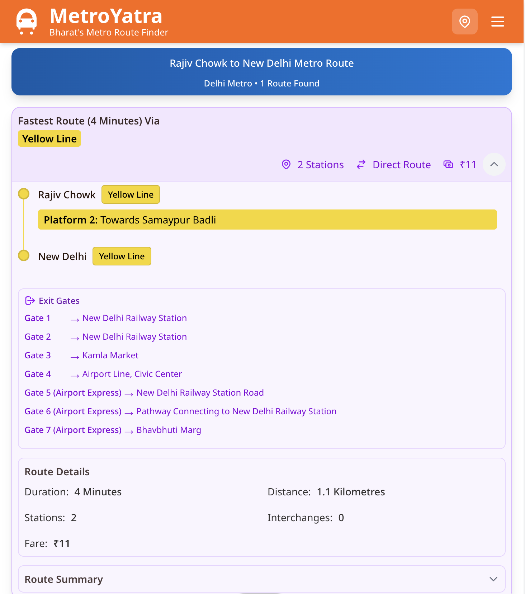

  

<h1 align="center">MetroYatra</h1>

<strong>Your Complete Metro Route Finder For Indian Cities</strong>

  <a href="https://metroyatra.com">Website</a> •
  <a href="#get-in-touch">Contact</a>

---

# Table of Contents
- [About MetroYatra](#about-metroYatra)
- [What We Do](#what-we-do)
- [Key Features](#key-features)
- [Supported Metro Networks](#supported-metro-networks)
- [How It Works](#how-it-works)
- [Screenshots](#screenshots)
- [Roadmap](#roadmap)
- [Contributing](#contributing)
- [License](#license)
- [Get In Touch](#get-in-touch)

---

# About MetroYatra

MetroYatra is a fast, intelligent, and easy-to-use metro route planner built for India’s expanding metro systems. It helps commuters find the best routes, view platform information, check gate details, calculate travel times, and navigate metro networks with confidence.

Whether you are a daily commuter or a first-time metro user, MetroYatra makes metro travel simple, accurate, and stress-free.

---

# What We Do

MetroYatra delivers:

- Smart metro route planning  
- Platform numbers and interchange information  
- Exit gate guidance with nearby landmarks  
- Travel time estimates  
- Multiple route options  
- SEO-friendly public route URLs  
- Support for all major operational metro networks  

Our goal is to improve the commuting experience for millions of riders across India.

---

# Key Features

### Smart Route Finding  
Find the fastest, shortest, and most efficient metro routes between stations.

### Platform Information  
View platform numbers, boarding sides, and interchange instructions.

### Gate Details  
Know which exit gate leads to your nearest landmark.

### Travel Time Estimates  
Includes travel duration, interchange time, and walking time.

### Multiple Route Options  
Choose between convenience, least interchanges, or fastest travel time.

### SEO-Friendly URLs  
Clean, shareable route links for daily commuters.

---

# Supported Metro Networks

- Delhi Metro  
- Mumbai Metro  
- Namma Metro (Bengaluru)  
- Hyderabad Metro  
- Kolkata Metro  
- Noida Metro  
- Navi Mumbai Metro  
- Ahmedabad Metro  
- Lucknow Metro  
- Kanpur Metro  
- Patna Metro  
- More networks coming soon…

---

# How It Works

1. Select your metro city  
2. Choose the From and To stations  
3. MetroYatra analyzes all possible route combinations  
4. Compares distances, interchanges, and travel time  
5. Shows options including:
   - Fastest route  
   - Shortest route  
   - Most convenient route  
6. Displays platform details, gate numbers, and interchange guidance  
7. Generates a shareable, SEO-friendly route URL  

---

# Screenshots

### Homepage  

### Route Result  

### Logo  

---

# Roadmap

### Upcoming Features
- Global Metro Route Finder  
- Mobile apps (Android and iOS)  
- Hindi and multilingual support  
- Offline mode  
- Bus/auto/taxi connectivity  

---

# Contributing

We welcome suggestions, improvements, and data corrections.

Ways to contribute:

- Report issues  
- Suggest new features  
- Provide metro data corrections  
- Request support for new metro cities  

---

# License

This repository is for documentation and branding purposes.  
The core source code is private.

---

# Get In Touch

Have feedback or suggestions? We would love to hear from you.

Email: support@metroyatra.com  
Website: https://metroyatra.com  

---
